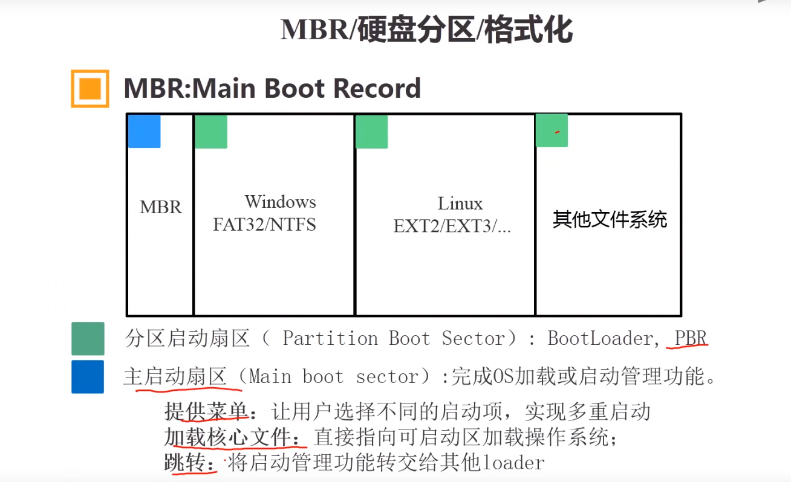

## 操作系统用户界面

### 操作系统启动过程

- 实模式（实地址模式， REAL MODE） 

  `启动过程属于实模式`

- 保护模式（内存保护模式， PROTECT MODE) 

  `启动完后属于保护模式 应用程序和操作系统的运行环境都被保护`

BIOS 是固件 ，固件： 以硬件的方式存在的程序/软件

BIOS 的功能：

- 系统启动服务
- 基本的设备I/O服务
- 系统的加电自检和启动

启动过程：从加电到用户工作环境准备好的过程

1. 初始引导

   目的：把OS核心装入内存并使之开始工作接管计算机系统

2. 核心初始化

   目的：OS内核初始化系统的核心数据

3. 系统初始化

   目的：为用户使用系统做准备，使系统处于待命状态

### 操作系统的生成

满足特定硬件环境和用户需求，组装和构建操作系统 

### 用户界面

- 定义：OS提供给用户控制计算机的机制，又称用户接口

- 分类

  - 操作界面

  - 系统调用

    操作系统 `内核`为应用程序提供的服务/函数（`用户态 -> 核态`） 
